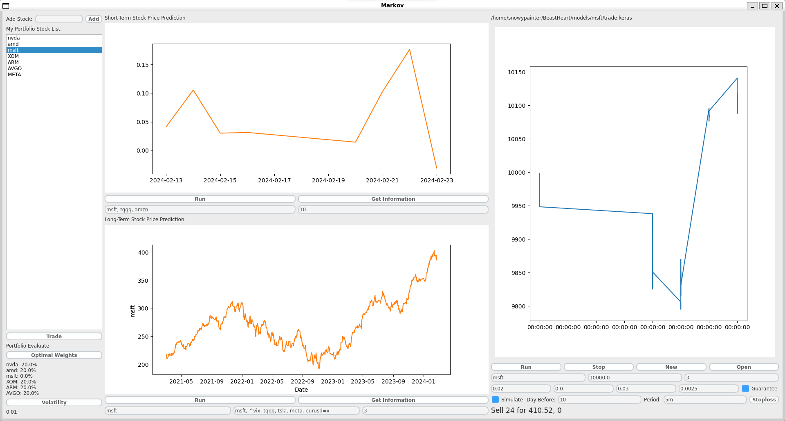
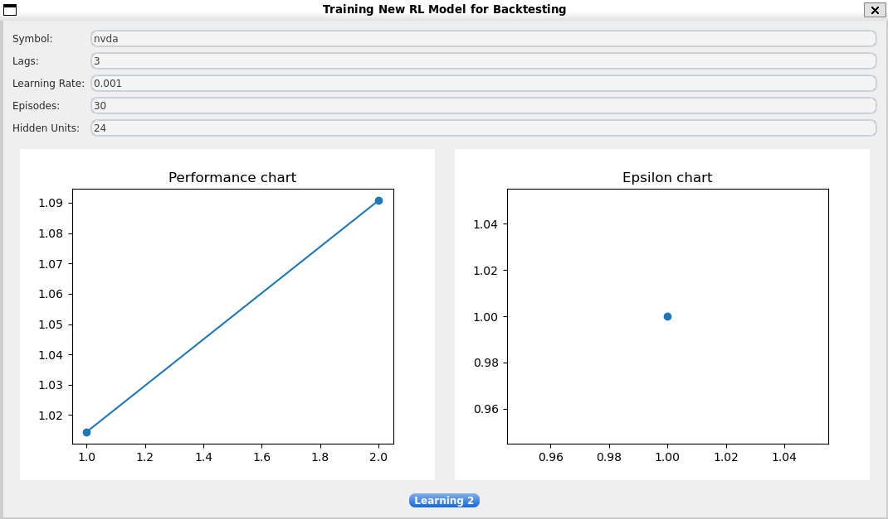
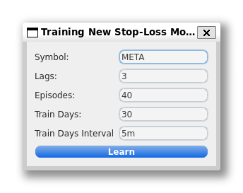
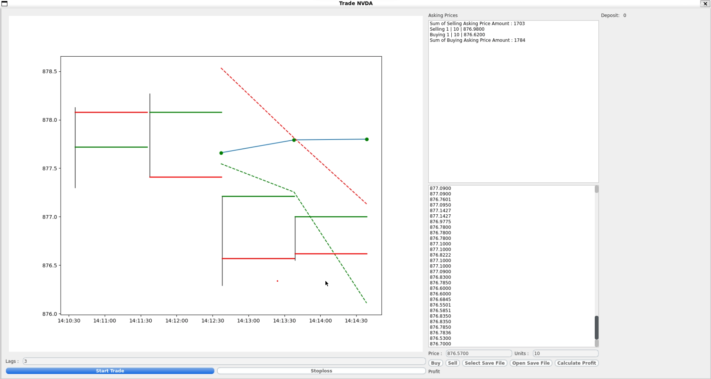

# Markov Assistant

## Supports
* Short-Term stock price's up & down prediction
* Long-Term stock price's movement
* Trading Bot Backtesting
* Trading Bot - Trade
* Simulating Trading Strategy with price, log rate return, SMA and VOL
* Stop Loss Monitoring

## Program Consists of:

### Main Window

You can take information whatever stock you want.

### Train New Backtest Model

You can make your own RL model for backtesting right here.

### Train New Stop loss Model

Model, just made for stop-loss

### Trade Window (Stoploss + Monitoring Stock REALTIME)

### Installing Environment
* CUDA: 12.4
* Python: 3.9.12
* Keras: 2.15.0
* numpy: 1.26.3
* pandas: 1.4.2
* PyQt5: 5.15.10
* pyqtgraph: 0.13.3
* tensorflow: 2.15.0
* yfinance: 0.2.36