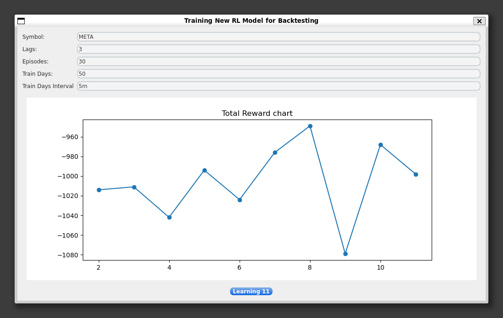

# Markov

## Markov trading system supports
* Short-Term stock price's up & down prediction (customizable)
* Long-Term stock price's movement (customizable)
* Trading Bot (customizable)
* Simulating Trading Strategy with price, log rate return, rolling(20) mean and rolling(20) std

## Program Consists of:

### Main Window

You can take information whatever stock you want.

### Train New RL Window

You can make your own RL model right here.

### Installing Environment
* CUDA: 12.4
* Python: 3.9.12
* Keras: 2.15.0
* numpy: 1.26.3
* pandas: 1.4.2
* PyQt5: 5.15.10
* pyqtgraph: 0.13.3
* tensorflow: 2.15.0
* yfinance: 0.2.36